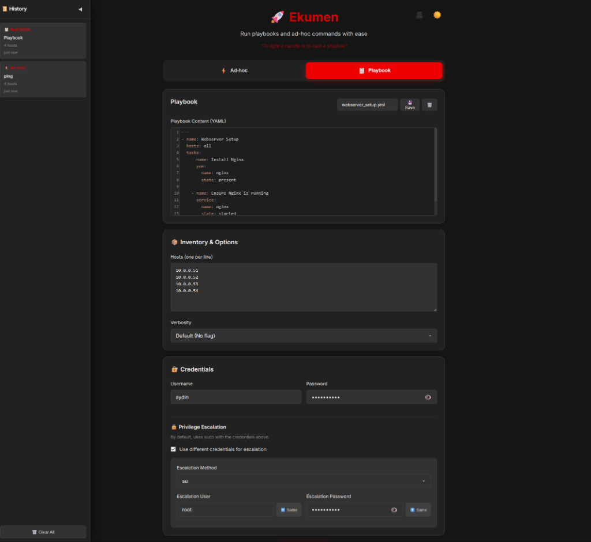
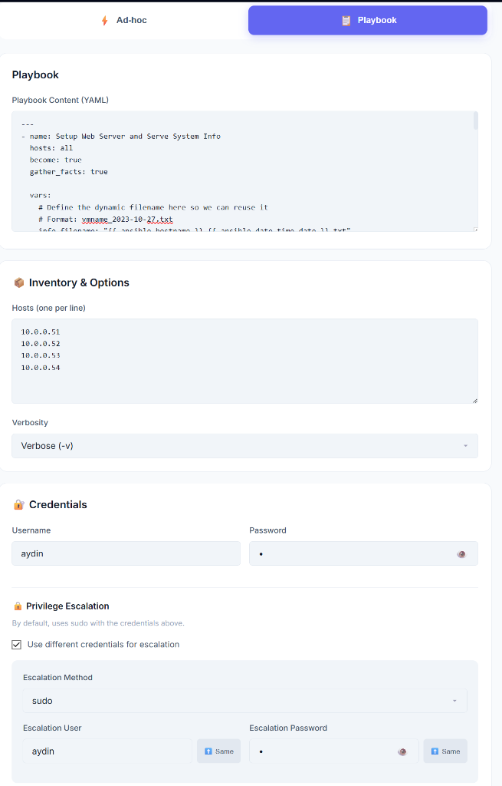
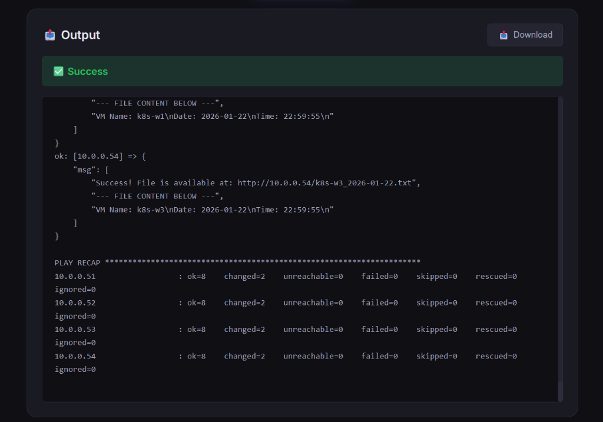

# Ekumen

A simple web interface for running Ansible playbooks and ad-hoc commands.

In Ursula K. Le Guin's Hainish Cycle, the *ansible* is a device that allows instantaneous communication across any distance — named from "answerable." The Ekumen is the interstellar collective that uses ansibles to coordinate between worlds separated by light-years, achieving unity through patience and understanding rather than force. Red Hat's Ansible automation tool borrowed the name, and this project borrows from both: connecting distant servers through a web interface, one playbook at a time.


## Features

- **Ad-hoc Commands** — Run quick Ansible modules against your hosts
- **Playbook Execution** — Execute full YAML playbooks from the browser
- **Secure Authentication** — SSH password and privilege escalation support
- **Output Download** — Save command outputs as text files
- **Dark Interface** — Easy on the eyes for long sessions

## Requirements

- **Python 3.8+** (installed by script if missing, but pre-install recommended)
- **Ansible** (Must be installed on the server)
- **pexpect** (Installed automatically by the setup script)

## Quick Install

To install Ekumen using the latest release:

```bash
curl -fsSL https://raw.githubusercontent.com/aydinguven/ekumen/main/install.sh | sudo bash
```

The service will start automatically on port 5000.

## Offline Install

To install on a server without internet access using the bundled wheels:

1. Download the latest release from another machine: [ekumen-v1.1.0.tar.gz](https://github.com/aydinguven/ekumen/releases/latest/download/ekumen-v1.1.0.tar.gz)
2. Transfer the file to your server.
3. Run the installer:
```bash
tar -xzf ekumen-v1.1.0.tar.gz
cd ekumen-v1.1.0
sudo ./install-offline.sh
```

**Compatibility:**
- **OS:** Linux (x86_64, ARM64)
- **Python:** 3.8 – 3.14 (Wheels included)

## Uninstall

```bash
sudo systemctl stop ekumen
sudo systemctl disable ekumen
sudo rm /etc/systemd/system/ekumen.service
sudo systemctl daemon-reload
sudo rm -rf /opt/ekumen
```


## Configuration

Set environment variables for production:

```bash
export ANSIBLE_SHUTTLE_DEBUG=false
export ANSIBLE_SHUTTLE_HOST=0.0.0.0
export ANSIBLE_SHUTTLE_PORT=5000
```

## Usage

### Development

```bash
python app.py
```

### Production

```bash
gunicorn -w 4 -b 0.0.0.0:5000 app:app
```

Access the web interface at `http://localhost:5000`

## Screenshots

### Dark Mode


### Light Mode


### Command Output


## Security Notes

- This application executes Ansible commands on the server
- Deploy behind a reverse proxy with HTTPS in production
- Restrict network access appropriately
- Passwords are never stored, only used in-memory for execution

## License

MIT License - see [LICENSE](LICENSE) for details.

## Contributing

Contributions are welcome! Please open an issue or submit a pull request.
