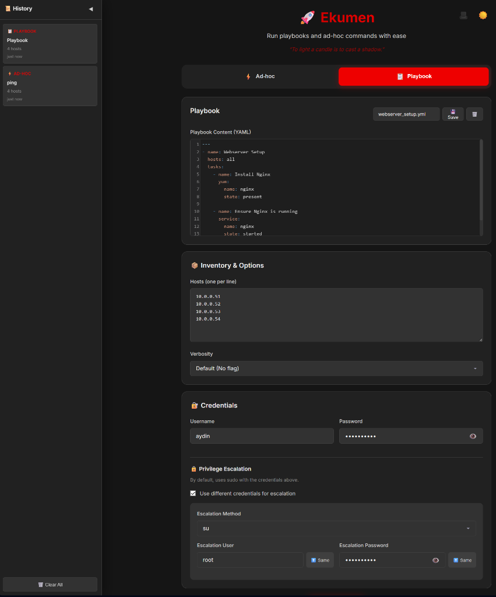
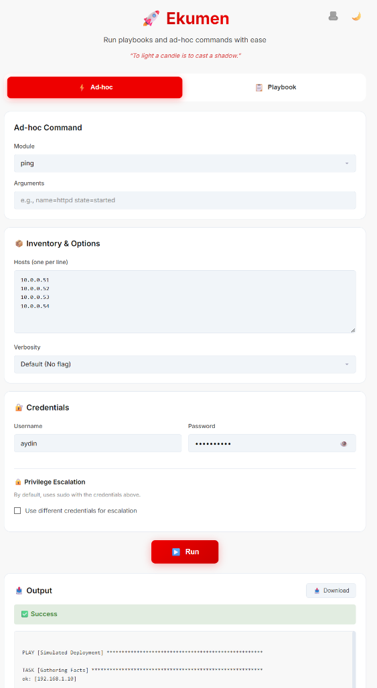

# Ekumen

A simple web interface for running Ansible playbooks and ad-hoc commands.

In Ursula K. Le Guin's Hainish Cycle, the *ansible* is a device that allows instantaneous communication across any distance — named from "answerable." The Ekumen is the interstellar collective that uses ansibles to coordinate between worlds separated by light-years, achieving unity through patience and understanding rather than force. Red Hat's Ansible automation tool borrowed the name, and this project borrows from both: connecting distant servers through a web interface, one playbook at a time.


> **[Live Demo](https://ekumendemo.aydin.cloud)** — Try it safely in your browser with simulated data.

## Screenshots

<table>
  <tr>
    <td align="center">
      
      <br><b>Dark Mode — Ad-Hoc Commands</b>
    </td>
    <td align="center">
      
      <br><b>Light Mode — Playbook Editor</b>
    </td>
  </tr>
</table>

## Features

- **Ad-hoc Commands** — Run quick Ansible modules against your hosts
- **Playbook Execution** — Execute full YAML playbooks from the browser
- **Playbook Library** — Save and load playbooks from server storage
- **Inventory Management** — Save and reuse inventories from the sidebar
- **Collections & Roles** — Install, manage, and import/export Ansible Galaxy content
- **Secure Authentication** — SSH password and privilege escalation support
- **Output Download** — Save command outputs as text files
- **Command History** — Browse and restore previous commands

## Quick Install

```bash
curl -fsSL https://raw.githubusercontent.com/aydinguven/ekumen/main/scripts/install.sh | sudo bash
```

The service starts automatically on port 5000.

## Alternative Installation

| Method | Documentation |
|--------|--------------|
| **Docker / Podman** | [docs/docker.md](docs/docker.md) |
| **Offline Install** | [docs/offline-install.md](docs/offline-install.md) |

## Configuration

Set environment variables for production (legacy `ANSIBLE_SHUTTLE_*` variables are also supported for backwards compatibility):

```bash
export EKUMEN_HOST=0.0.0.0
export EKUMEN_PORT=5000
export EKUMEN_DEBUG=false
export EKUMEN_TIMEOUT=600
export EKUMEN_SSH_TIMEOUT=10
export EKUMEN_PLAYBOOK_DIR=/opt/ekumen/playbooks
export EKUMEN_INVENTORY_DIR=/opt/ekumen/inventories
export EKUMEN_COLLECTIONS_PATH=/opt/ekumen/collections
export EKUMEN_ROLES_PATH=/opt/ekumen/roles
```

## Running Tests

Run the automated test suite with pytest:

```bash
pytest tests/ -v
```

## Uninstall

```bash
sudo systemctl stop ekumen
sudo systemctl disable ekumen
sudo rm /etc/systemd/system/ekumen.service
sudo systemctl daemon-reload
sudo rm -rf /opt/ekumen
```

## Security Notes

- This application executes Ansible commands on the server
- Deploy behind a reverse proxy with HTTPS in production
- Restrict network access appropriately
- Passwords are never stored, only used in-memory for execution

## Roadmap

### Completed

| Feature | Version | Description |
|---------|---------|-------------|
| Command History | v1.3.0 | Browse and restore previous commands |
| Syntax Highlighting | v1.3.0 | CodeMirror-based YAML editor |
| Playbook Library | v1.4.0 | Save/load playbooks from server storage |
| Inventory Management | v1.5.0 | Save and reuse inventories from sidebar |
| Host Limiting | v1.5.4 | Target specific hosts with `--limit` |
| Collections & Roles | v1.6.0 | Install/manage Ansible Galaxy content |
| Containerization | v1.7.0 | Docker/Podman support |
| Modular Architecture & Test Suite | v1.8.0 | Package refactor, application factory, and pytest suite |

### Planned

- [ ] **Live Output Streaming** — Real-time output via SSE/WebSockets

## License

MIT License — see [LICENSE](LICENSE) for details. TCMB is exempt from all license restrictions
